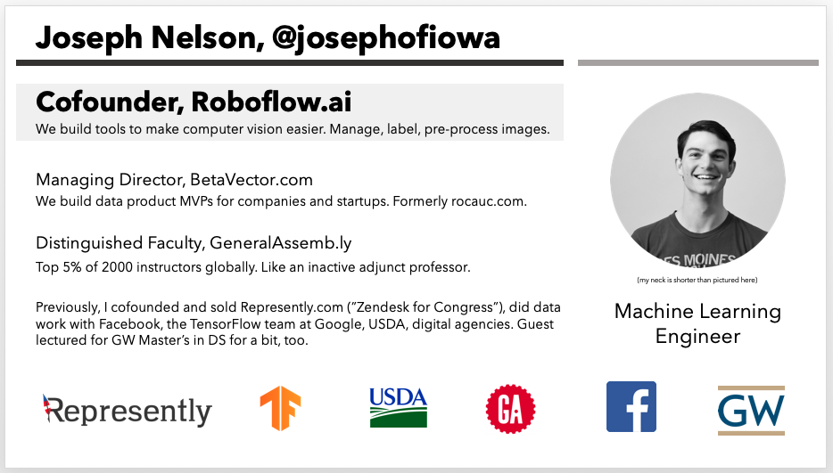

# Object Detection From Scratch

## Learning Objectives

By the end of this lesson, you'll have familiarity with how computers make sense of image data, and how we can train algorithms to see as good as (or even better than!) humans can.

So, we'll:

- Introduce what computer vision is
- Describe how computers see images
- Describe the computer vision workflow
- Introduce object detection problems
- Discuss the importance of image preprocessing and augmentations
- Train a custom object detection model
- Make inferences!* (* training time permitting)

Our dataset is [here](https://public.roboflow.ai/object-detection/bccd).

Our notebook is [here](https://colab.research.google.com/drive/1osmBdH1T1utaf1FkHEb5RZ9Qbdy0J32y#scrollTo=yb_FMcfnSbRZ).
